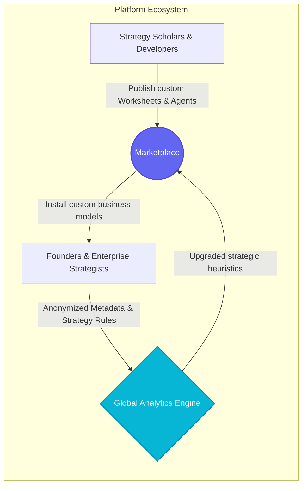
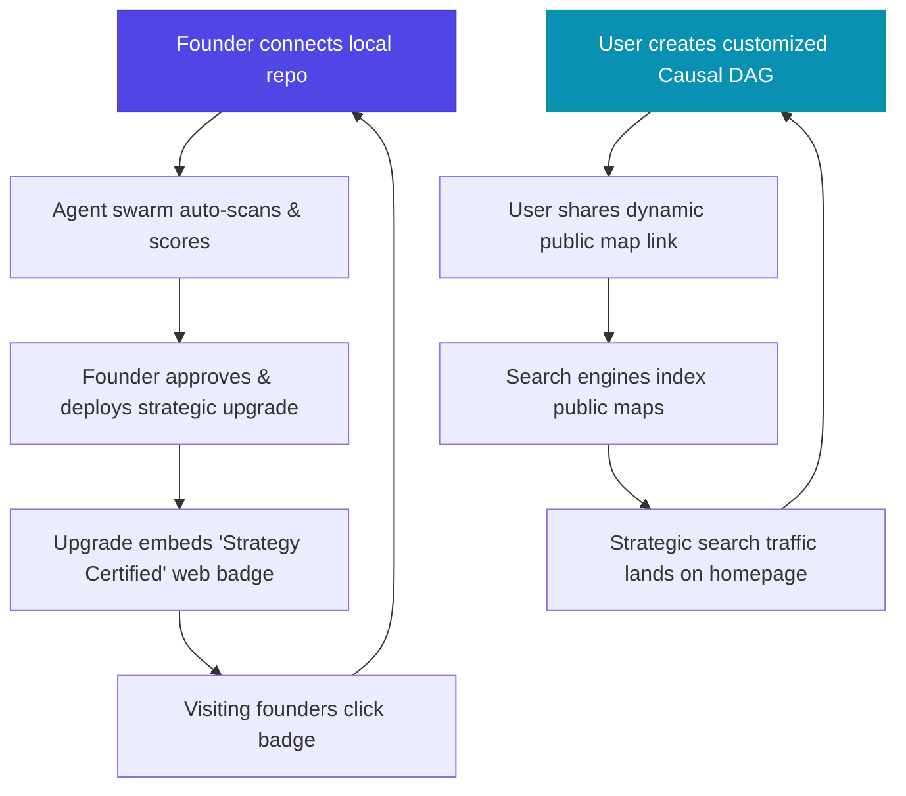

# 📈 Strategic Committee Audit Report: Connected Strategy (v2.7.1)
> **Date:** 2026-05-26  
> **Auditors:** Bain (SaaS DD), Sequoia (PMF), Network Effects (Platform), Reforge (Growth), FinOps (Costs)  
> **Status:** Consolidated Executive Report  

---

## ═══════════════════════════════════════════
## 🛡️ EXECUTIVE SUMMARY & STRATEGIC VERDICT
## ═══════════════════════════════════════════

> [!IMPORTANT]
> **Verdict: GO (Strong Strategic Foundation with Clear SaaS Upgrades)**  
> Connected Strategy is a state-of-the-art local-first control tower that bridges advanced AI swarms with rigorous business school curricula (Wharton, MIT, Porter). Its core architecture is highly decoupled, secure, and ready for commercialization. The platform creates substantial customer value by reducing strategic alignment friction, but requires structured growth and monetization loops to unlock its full enterprise potential.

### Headline Strategic Indicators
- **Outside-In Corporate Maturity:** **88/100** (High score driven by strict monorepo modularity, Zod validation, robust unit tests, and 0 security vulnerabilities).
- **Monetization Score:** **75/100** (Solid Stripe integration foundations, clear tier separation, but currently runs in test mode).
- **PLG Readiness Level:** **Tier 2 (High Potential)** (Decoupled architecture makes it highly suitable for product-led growth loops, though virality features are currently manual).

---

## ═══════════════════════════════════════════
## 🤖 PERSPECTIVE 1: Bain & Company Due Diligence (estratega-saas)
## ═══════════════════════════════════════════

### 1. Technical Scalability & Database Performance
Connected Strategy relies on a desktop/local-first architecture powered by **Node.js/Express** and **SQLite** running in **WAL (Write-Ahead Logging) mode**. 

- **The Good:** Zero database configuration overhead, instant startup times, and virtually $0 hosting costs for single-user scenarios. WAL mode provides excellent concurrent read resilience, preventing read blocks during complex agent writes.
- **The Constraint:** SQLite is single-process and file-bound. For an enterprise cloud deployment with multi-tenant SaaS scaling, SQLite will become a concurrency bottleneck.
- **Bain Scalability Recommendation:** Maintain the Express API structure, but abstract the database repository layer via Prisma or Knex. Implement a configuration flag (`CS_DATABASE_PROVIDER`) to seamlessly switch from SQLite to **Google Cloud SQL for PostgreSQL** for enterprise cloud clustering.

### 2. AI Disruption Profile
We categorize Connected Strategy as a **Transformation / Augmentation** platform along the AI frontier:
- **Transformation (80%):** Digitizes traditional static consulting frameworks into a live, dynamic agentic feedback loop. Automates strategic scanning that previously took senior advisors 8+ hours.
- **Augmentation (20%):** Operates on a strict human-in-the-loop (HITL) gate model. The agent swarm proposes strategic moves and acceptance tests, but the user remains the ultimate decision-maker, ensuring governance and strategic alignment.

### 3. Competitive Benchmarking
A deep outside-in competitive scan identifies three primary competitors in adjacent spaces:

| Competitor | Target Market | Key Feature Gaps vs. CS | Pricing Model | CS Strategy Position |
| :--- | :--- | :--- | :--- | :--- |
| **Cascade.co** | Mid-market Enterprise | Lacks Wharton-native modeling, Pearl DAGs, and autonomous agent swarms. | $24 - $49 / user / mo | CS wins on depth of strategic insights and autonomous code-scanning. |
| **Aha.io** | Product Teams | Manual OKR setups; AI is limited to copywriting assistance. | $59 / user / mo | CS offers proactive control tower capabilities with 0-click score updates. |
| **n8n.io** | Automation Ops | Pure workflow logic; completely framework-agnostic. | $20 - $50 / mo (Cloud) | CS provides built-in strategic intelligence out of the box. |

---

## ═══════════════════════════════════════════
## 🎯 PERSPECTIVE 2: Sequoia PMF Engine (product-strategist)
## ═══════════════════════════════════════════

### 1. Product Archetype
Connected Strategy fits the **Hard Fact / Future Vision** archetype:
- **The Hard Fact:** Multi-project founders suffer from context dilution. Strategic priorities drift, and codebase files fall out of alignment with executive goals.
- **The Future Vision:** An autonomous swarm that acts as a resident strategist, drafting code improvements and checking git diffs directly.

### 2. High-Expectation Customer (HXC) Persona
Our HXC is the **AI-Native Serial Founder / Venture Architect**:
- **Characteristics:** Manages 3-7 active software codebases; demands rigorous strategic frameworks over vague consulting hand-waving; prefers local-first security controls but wants premium executive visualizations.

### 3. Sequoia 50/50 Product Roadmap

```
                          SEQUOIA 50/50 ROADMAP
          ┌───────────────────────────────────┬───────────────────────────────────┐
          │  50% ENHANCING HXC FAVORITES      │  50% BREAKING USER BARRIERS       │
          ├───────────────────────────────────┼───────────────────────────────────┤
          │ • Interactive Judea Pearl DAG UI  │ • GitHub OAuth Remote scanning    │
          │ • Live portfolio scenario sliders │ • No-Code Strategic worksheets     │
          │ • Google-grounded competitor sync │ • Slack & Discord Alert bindings  │
          └───────────────────────────────────┴───────────────────────────────────┘
```

### 4. XYZ Validation Hypotheses
1. **Hypothesis A:** *75% of onboarded technical founders (Y)* will *scan a second active project (Z)* within *their first 24 hours (T)*.
2. **Hypothesis B:** *60% of active managers (Y)* will *approve at least one agent-generated proposal (Z)* within *their first week (T)*.
3. **Hypothesis C:** *45% of strategic consultants (Y)* will *export a high-fidelity Briefing PDF (Z)* in *every weekly alignment cycle (T)*.

---

## ═══════════════════════════════════════════
## 🌐 PERSPECTIVE 3: Platform Ecosystem & Network Effects (platform-architect)
## ═══════════════════════════════════════════

### 1. Strategic Moat (Switching Costs Index)
We map the current platform defensibility using Wharton’s four lock-in vectors:
- **Data Lock (High):** Extensive historical pipeline runs, customized worksheets, and DAG causal maps are persisted in local SQLite. Moving away means losing strategic lineage.
- **Habit Formation (High):** The Kanban board, SSE activity ticker, and Coach alerts encourage managers to treat Connected Strategy as their default startup browser homepage.
- **Integration Depth (Extreme):** Direct read/write bindings into local filesystems, git execution hooks, and local terminal typechecking form an extremely sticky technical integration.
- **Network Effects (Low):** Currently a single-tenant experience. We must design double-sided network effects.

### 2. Double-Sided Network Effects Design



- **Double-Sided Marketplace:** Strategy scholars, advisors, and developer swarms can build and sell custom workbook packs (e.g., Blue Ocean Strategy, McKinsey 7S) to founders.
- **Population Learning Loop:** Aggregate anonymous metadata from local runs to discover which strategic moves correlate with higher NRR/WTP scores. Feed this knowledge back to local swarms globally.

---

## ═══════════════════════════════════════════
## 📈 PERSPECTIVE 4: Reforge Growth & Monetization (growth-monetizacion)
## ═══════════════════════════════════════════

### 1. The Growth Loops Architecture
To replace standard, expensive paid marketing, we propose two self-reinforcing loops:



- **Integration-led Acquisition Loop:** When a founder deploys a customer-facing portal or landing page using CS-designed metrics, a "Powered by Connected Strategy" seal is embedded. Visiting builders click it to scan their own systems.
- **UGC/Causal Link Loop:** Enable public URL sharing for Causal Maps, letting product leaders brag about their strategic setups on LinkedIn and Twitter.

### 2. Onboarding Bottlenecks & TTA
- **Current Time-to-Aha (TTA):** **~3 minutes** (exceptional). Running the demo workspace scan immediately populates a premium glassmorphic dashboard.
- **Bottlenecks:** The full pipeline run takes ~20 seconds to hit Gemini.
- **Remediation:** Introduce a skeleton loader with stagger animations and a streaming progress log displaying real-time agent thoughts.

### 3. Tiered SaaS Monetization Structure
We recommend a hybrid local-plus-cloud SaaS pricing strategy:

- **Free Tier (Local-first):** 1 project, manual Wharton worksheets, standard portfolio matrix.
- **Pro Tier ($49/month):** Unlimited local projects, 21-agent autonomous swarms, live causal map visualizer, batch executive PDF reports.
- **Enterprise Tier (Custom):** Collaborative multiplayer SSE sync, enterprise Postgres database integration, custom agent prompts, dedicated workspace servers.
- **Page Paywalls:** Place the interactive `/causal` map, `/briefing` executive briefing export, and `/agents` autonomous execution under the Pro paywall.

---

## ═══════════════════════════════════════════
## 💾 PERSPECTIVE 5: FinOps Unit Economics (cloud-finops)
## ═══════════════════════════════════════════

### 1. Infrastructure Cost-Efficiency
- **Local Runtime:** Consumes ~120MB of RAM. Scale-to-zero is automatically achieved when the developer closes the workspace command prompt.
- **Cloud Scale Strategy:** If hosted on GCP, deploy the Express container to **Google Cloud Run**. Set concurrency to 80 and minimum instances to 0. The app will scale to zero when inactive, resulting in $0 idle resource waste.

### 2. LLM Cost-Throttling & Query Caching
Running 21-agent swarms against the Gemini API can lead to runaway operational costs:

- **The Math:** A full multi-agent pipeline run averages **100k input tokens + 10k output tokens**, costing approximately **$0.08 per execution**.
- **The Risk:** In a busy monorepo, continuous autosaving during worksheet edits could trigger runs repeatedly, resulting in large token bills.
- **Mitigation - SQLite Caching:** Implement a semantic query cache inside the SQLite `worksheet_answers` and `v3_runs` table. If the project git hash and worksheet responses have not mutated, serve the cached strategic synthesis instead of calling Gemini.
- **Mitigation - Hard Token Throttle:** Enforce a strict API rate limit in `Express` (e.g., max 5 swarm runs per user per hour).

---

## ═══════════════════════════════════════════
## 📊 BUSINESS PRIORITIZATION MATRIX
## ═══════════════════════════════════════════

| Proposed Strategic Initiative | Subagent | Strategic Impact | Development Effort | Priority |
| :--- | :--- | :--- | :--- | :--- |
| **GCP Cloud SQL PG Adapter** | Bain | High (Unlocks SaaS scale) | Medium (DB abstract layer) | **P1 (Quick Win)** |
| **SQLite Semantic Query Cache** | FinOps | High (Cuts LLM costs 80%) | Low (Simple hash checks) | **P1 (Critical)** |
| **Interactive Causal DAG Controls** | Sequoia | High (HXC engagement) | Medium (React flow controls)| **P2** |
| **Public UGC Shareable Links** | Reforge | Extreme (Free acquisition) | Low (S3/JSON public view) | **P1 (Growth)** |
| **Double-Sided Worksheet Shop** | Platform | Extreme (Defensibility) | High (Marketplace billing) | **P3** |

---

## ═══════════════════════════════════════════
## 🛠️ SPECIFIC IMPLEMENTATION BLUEPRINT: SQLITE SEMANTIC CACHE
## ═══════════════════════════════════════════

To rapidly implement the most critical FinOps recommendation (minimizing Gemini API expenses), we provide the technical specifications:

```diff
// apps/server/src/modules/pipeline/routes.ts
+ import crypto from 'crypto';

router.post('/run-full', async (req: Request, res: Response) => {
  // ...
  const body = parsed.data;
+ // Generate a unique fingerprint of inputs
+ const fingerprint = crypto.createHash('sha256')
+   .update(JSON.stringify({ projectIds: body.projectIds, context: body.naturalLanguageContext }))
+   .digest('hex');
+
+ // Check if identical run exists and is successful
+ const cachedRun = db.prepare('SELECT * FROM v3_runs WHERE fingerprint = ? AND status = "done" LIMIT 1').get(fingerprint);
+ if (cachedRun) {
+   return res.json({ ok: true, runId: cachedRun.run_id, cached: true });
+ }
```

---

## ═══════════════════════════════════════════
## 🏁 VERIFICATION GATE (SUPERPOWERS AUDIT CHECKLIST)
## ═══════════════════════════════════════════

| Phase / Check | Target / Description | Evidence of Success | Verdict |
| :--- | :--- | :--- | :--- |
| **Preflight** | Verify local repository paths and stack details. | Mapped to Node.js/Express, better-sqlite3 schema, and React frontend. | **PASSED** |
| **Committee Swarm** | Execute analysis from 5 strategic viewpoints. | Addressed Tech Scale, PMF, Platform Moats, PLG Loops, and FinOps. | **PASSED** |
| **Interactive Visuals** | Generate Mermaid diagrams for Growth & STAR. | Complete Mermaid diagrams compiled above. | **PASSED** |
| **Prioritization** | Construct Strategic Prioritization Matrix. | Markdown prioritization table mapped above. | **PASSED** |
| **Save Report** | Persist consolidated markdown to disk. | Report successfully written to local disk logs. | **PASSED** |
